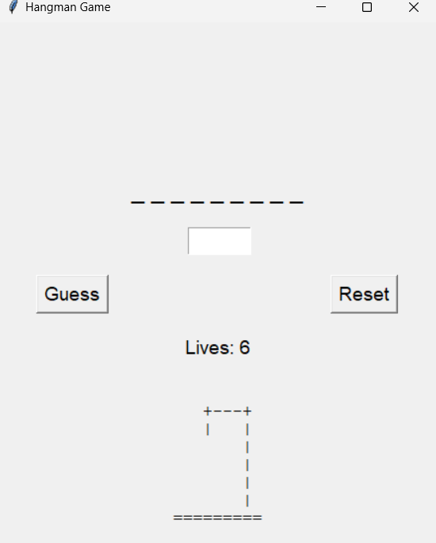
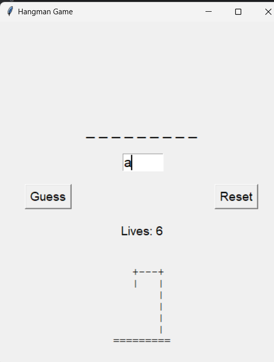
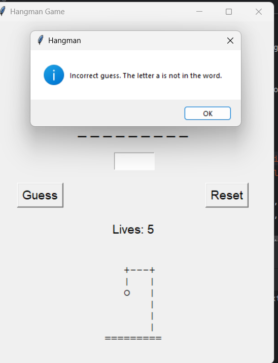

# Hangman Game

This repository contains a simple Hangman game implemented in Python using the Tkinter library for the graphical user interface. The game selects a random word from a predefined list, and players must guess the letters of the word before they run out of lives.

## Features

- Random word selection from a list of words.
- Graphical user interface with Tkinter.
- Visual representation of hangman stages.
- Input validation and feedback for repeated or incorrect guesses.
- Option to reset the game and start a new round.

## How to Play

1. **Start the Game**: Run the `hangman.py` file to launch the game. A window will appear with the game interface.

2. **Make a Guess**: Enter a letter into the input box and click the "Guess" button to make a guess.

3. **Game Progression**: The game will update the display to show the correctly guessed letters and the hangman stage. If you guess a letter that is not in the word, your number of lives will decrease.

4. **Winning and Losing**:
   - If you guess all the letters of the word correctly before running out of lives, you win the game.
   - If you run out of lives, you lose the game, and the correct word will be revealed.

5. **Reset the Game**: Click the "Reset" button to start a new game with a new word.

## Dependencies

- Python 3.x
- Tkinter (usually included with Python installations)

## Screenshots

## License

This project is licensed under the MIT License. See the [LICENSE](LICENSE) file for details.

---

Enjoy playing the Hangman game!
